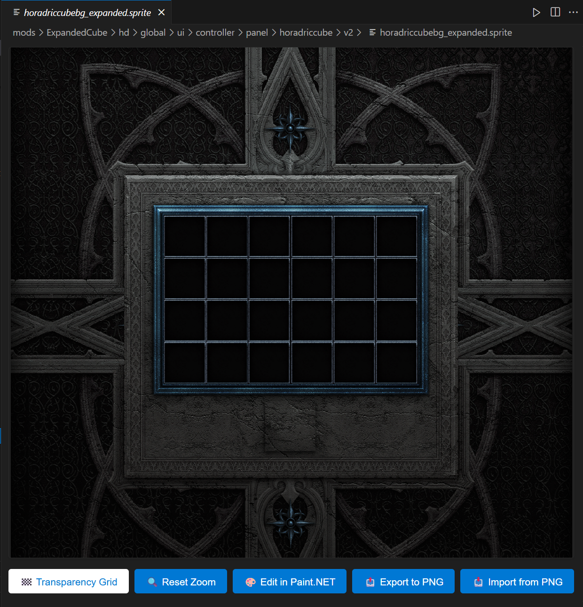

# D2R Sprite Editor

A Visual Studio Code extension for viewing and editing Diablo 2 Resurrected (D2R) sprite files.



## Features

- **D2R Sprite Viewer**: Automatically opens `.sprite` files in a dedicated viewer
- **Pixelated Rendering**: Crisp pixel art display optimized for sprite files
- **Interactive Controls**: Zoom, pan, and transparency grid toggle
- **Paint.NET Integration**: Edit sprites externally with automatic sync
- **PNG Conversion**: Export sprites to PNG and import PNG back to sprite format
- **Large File Support**: Handles sprites up to 512x512 pixels efficiently

## Supported Formats

- **D2R Sprites** (`.sprite` files): SpA1/SPa1 format with BGRA pixel data
- Used for character sprites, items, and game assets in Diablo 2 Resurrected

## Quick Start

1. **Open a sprite file**: Click any `.sprite` file in VS Code
2. **Auto-viewer**: The D2R Sprite Viewer opens automatically
3. **Interactive controls**: Use mouse wheel to zoom, drag to pan

## Controls

| Button | Function | Description |
|--------|----------|-------------|
| 🏁 **Transparency Grid** | Toggle background | Show/hide checkerboard pattern |
| 🔍 **Reset Zoom** | Reset to 100% | Return to original size |
| 🎨 **Edit in Paint.NET** | External editor | Launch Paint.NET with auto-sync |
| 📤 **Export to PNG** | Save as PNG | Convert sprite to PNG format |
| 📥 **Import from PNG** | Load from PNG | Update sprite from PNG file |

## Installation

### From VSIX Package

1. Download the latest `d2r-sprite-editor-2025-1.0.0.vsix` file
2. Open VS Code
3. Go to Extensions (Ctrl+Shift+X)
4. Click the "..." menu and select "Install from VSIX..."
5. Select the downloaded VSIX file

### From VS Code Marketplace

1. Open VS Code Extensions (Ctrl+Shift+X)
2. Search for "D2R Sprite Editor"
3. Click Install

## External Editing Workflow

1. Click **"Edit in Paint.NET"**
2. Paint.NET opens with the sprite as PNG
3. Make your edits and save
4. The sprite file updates automatically
5. View changes instantly in VS Code

## Requirements

- **VS Code**: 1.48.0 or higher
- **Paint.NET**: Optional, for external editing

## Technical Details

- **Format Support**: D2R SpA1/SPa1 sprite format
- **Pixel Format**: BGRA with transparency
- **Max Dimensions**: 4096x4096 pixels
- **Performance**: Optimized for large sprites (tested up to 512x512)

## Documentation

For complete documentation, see the [docs](docs/) folder:

- **[User Guide](docs/USER-GUIDE.md)** - Complete usage instructions
- **[Development Guide](docs/DEVELOPMENT.md)** - Setup and contribution info
- **[Sprite Format](docs/SPRITE-FORMAT.md)** - Technical format details

## License

MIT License - see [LICENSE](LICENSE) for details

## Contributing

1. Fork the repository
2. Create a feature branch
3. Submit a pull request

See [DEVELOPMENT.md](docs/DEVELOPMENT.md) for detailed contribution guidelines.

## Support

For issues or questions:

- [GitHub Issues](https://github.com/bethington/vscode-sprite-editor-extension/issues)
- [VS Code Marketplace](https://marketplace.visualstudio.com/items?itemName=d2rmodding.d2r-sprite-editor-2025)

## Build Instructions

```bash
# Install dependencies
npm install

# Compile TypeScript
npm run compile

# Package extension
vsce package

# Run tests
npm test
```

## Current Features

- ✅ **Sprite Viewing**: High-quality pixelated rendering
- ✅ **PNG Export/Import**: Bidirectional conversion
- ✅ **Paint.NET Integration**: External editing workflow
- ✅ **File Watching**: Automatic updates from external edits
- ✅ **Zoom & Pan**: Interactive navigation
- ✅ **Transparency Grid**: Visual aid for transparent areas

## Planned Features

- Batch conversion tools
- Additional image editor integrations
- Sprite animation support
- Metadata editing

## Version

**Current Version**: 1.0.0 - Complete rewrite with modern TypeScript architecture
